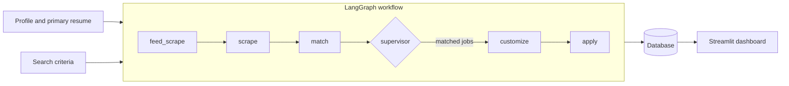
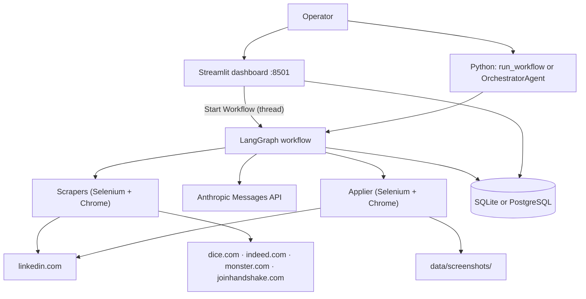
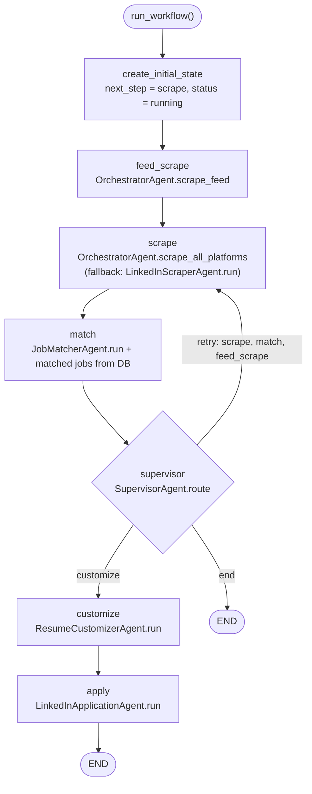

<div align="center">

# Springboard — Multi-Platform Job Search, Claude Job Scores and LinkedIn Easy Apply Automation

**Springboard is a multi-agent job-search automation system. It takes a candidate profile and search criteria through these steps to scored jobs, tailored resumes and recorded Easy Apply applications:**

`scan the LinkedIn feed` → `scrape the job platforms` → `score each job with Claude` → `route` → `customize the resume` → `apply with Easy Apply` → `record the result`.


**[Summary](#1-summary)** ·
**[Workflow](#4-the-end-to-end-workflow)** ·
**[Scrapers](#7-the-platform-scrapers)** ·
**[Easy Apply](#10-the-easy-apply-agent)** ·
**[Run it](#14-how-to-run-springboard)** ·
**[Configuration](#144-environment-variables)** ·
**[Known problems](#17-known-problems)** ·
**[Glossary](#19-glossary)**

</div>

> [!NOTE]
> This README uses ASD-STE100 Simplified Technical English. The writing rules and the project
> vocabulary are in [`docs/ste-style-guide.md`](docs/ste-style-guide.md). Each term in the
> [Glossary](#19-glossary) has only one meaning.

> [!CAUTION]
> Fill the profile before you let the applier submit a form. If the profile has no value, the applier answers work authorization with `Yes`, sponsorship with `No` and years of experience with `5`.
> Keep your credentials only in `.env`. This file holds your LinkedIn password and your Anthropic API key, and git ignores it.
> Automated access and automated applications can break the terms of service of LinkedIn and of the other platforms. A platform can restrict your account.

---

Springboard searches for jobs on six platforms and scores each job against your profile with Claude.
Then it writes a tailored resume and a cover letter, and fills the LinkedIn Easy Apply form.
A LangGraph workflow connects the agents, and its supervisor node selects the next node or retries a failed node.
All results go into one SQLAlchemy database: jobs, scores, resume versions, applications and screenshot paths.
A Streamlit dashboard with nine pages shows the data and starts the workflow.
Random delays between actions and a daily cap limit the speed of the automation.

This README is the **one location that explains all of Springboard**. It gives these topics:

- the general design
- each agent, each scraper and each node, and its procedure, step by step
- the route rules and the status values
- the data map
- the runbook
- the validation results and the known problems

| If you are… | Read |
|---|---|
| A manager or reviewer | [1](#1-summary), [3](#3-design-rules), [4](#4-the-end-to-end-workflow), [16](#16-validation-results), [17](#17-known-problems), [18](#18-key-points) |
| A developer who joins the project | All sections, in sequence. Keep [14](#14-how-to-run-springboard), [15](#15-how-to-extend-springboard) and [17](#17-known-problems) open while you work |
| An operator who runs a job search | [14](#14-how-to-run-springboard), [12](#12-the-dashboard), then the section for the agent that you examine |

---

## Table of contents

1. 🧭 [Summary](#1-summary)
2. 🏗️ [How Springboard is built](#2-how-springboard-is-built)
   - 2.1 [Components](#21-components)
   - 2.2 [System context](#22-system-context)
   - 2.3 [Repository layout](#23-repository-layout)
3. 🛡️ [Design rules](#3-design-rules)
4. 🔄 [The end-to-end workflow](#4-the-end-to-end-workflow)
   - 4.1 [The LangGraph workflow](#41-the-langgraph-workflow)
   - 4.2 [The life cycle of one job](#42-the-life-cycle-of-one-job)
   - 4.3 [Status values](#43-status-values)
5. 🧠 [The workflow state and the supervisor](#5-the-workflow-state-and-the-supervisor)
6. 🎛️ [The orchestrator and the platform registry](#6-the-orchestrator-and-the-platform-registry)
7. 🔵 [The platform scrapers](#7-the-platform-scrapers)
   - 7.1 [The base scraper](#71-the-base-scraper)
   - 7.2 [LinkedIn jobs](#72-linkedin-jobs)
   - 7.3 [The LinkedIn feed](#73-the-linkedin-feed)
   - 7.4 [Dice, Indeed, Monster and Handshake](#74-dice-indeed-monster-and-handshake)
   - 7.5 [Glassdoor and ZipRecruiter](#75-glassdoor-and-ziprecruiter)
8. 🟢 [The job matcher](#8-the-job-matcher)
9. ✍️ [The resume customizer](#9-the-resume-customizer)
10. 🟣 [The Easy Apply agent](#10-the-easy-apply-agent)
11. 🗄️ [The database](#11-the-database)
12. 📊 [The dashboard](#12-the-dashboard)
13. 🗂️ [Data and file map](#13-data-and-file-map)
14. ▶️ [How to run Springboard](#14-how-to-run-springboard)
    - 14.1 [Prerequisites](#141-prerequisites) · 14.2 [Installation](#142-installation) · 14.3 [Run Springboard](#143-run-springboard) · 14.4 [Environment variables](#144-environment-variables) · 14.5 [The configuration file](#145-the-configuration-file)
15. 🧩 [How to extend Springboard](#15-how-to-extend-springboard)
16. ✅ [Validation results](#16-validation-results)
17. ⚠️ [Known problems](#17-known-problems)
18. 📌 [Key points](#18-key-points)
19. 📖 [Glossary](#19-glossary)

---

## 1. Summary

**The problem.** A job search on many platforms takes much time. The repeated parts are these:

- Find new jobs on LinkedIn, Dice, Indeed, Monster and Handshake, and find hiring posts in the LinkedIn feed.
- Decide which jobs fit your skills, experience, location, salary and target companies.
- Change the resume and write a cover letter for each job.
- Fill the same application form again and again.
- Keep a record of each application and each answer.

Springboard gives each of these tasks its own agent. Each agent reads its input from the database and writes its output back to the database.

| Item | Value |
|---|---|
| Input | A profile (the default `User` row), a primary resume, search criteria from `config/config.yaml` or from the caller |
| Output | Jobs with a match score and a reasoning text, tailored resume rows, application rows, screenshots in `data/screenshots/` |
| Workflow | A LangGraph `StateGraph` with **6** nodes: `feed_scrape`, `scrape`, `match`, `supervisor`, `customize`, `apply` |
| Agents | Orchestrator, supervisor, matcher, customizer, applier, and one scraper for each platform |
| Platforms | **6** registered: `linkedin`, `linkedin_feed`, `dice`, `indeed`, `monster`, `handshake`. **2** placeholders: `glassdoor`, `ziprecruiter` |
| AI model | `claude-sonnet-4-5-20250929` through the Anthropic Messages API (3 agents use it) |
| Match score | Weighted sum of **5** category scores: skills 0.40, experience 0.25, location 0.15, salary 0.10, company 0.10 |
| Applications | LinkedIn Easy Apply only. The other platforms send the candidate to an external site |
| Safety limits | Daily cap (default 20), random delays of 3 to 8 s between actions, 60 to 600 s between applications |
| Storage | SQLite file `data/springboard.db` (default) or another SQLAlchemy URL |
| Tests | **113** `pytest` tests, no network and no browser |



| Part | Agents | The questions that the part answers |
|---|---|---|
| 🔵 **Find** | Feed scraper, platform scrapers, orchestrator | Which jobs and hiring posts are new on each platform? |
| 🟢 **Decide** | Matcher, supervisor | How well does each job fit the profile? Which node runs next? |
| 🟣 **Act** | Customizer, applier | Which resume and cover letter fit this job? Did the Easy Apply form go through? |

---

## 2. How Springboard is built

### 2.1 Components

| Component | Module | Purpose |
|---|---|---|
| Workflow graph | `src/graph/workflow.py` | Builds and compiles the `StateGraph`, and gives `run_workflow()` |
| Workflow nodes | `src/graph/nodes.py` | One function for each node. Each node calls one agent and returns a state update |
| Workflow state | `src/state/app_state.py` | `AppState` with list reducers, and `create_initial_state()` |
| Supervisor | `src/agents/supervisor.py` | `SupervisorAgent`: route rule, retry rule, checkpoint fields, summary |
| Orchestrator | `src/agents/orchestrator.py` | Platform registry, `OrchestratorAgent`, progress events, `run_full_pipeline()` |
| Base scraper | `src/agents/base/base_scraper.py` | `BaseJobScraperAgent`: abstract interface, rate limit, retry, save, `run()` |
| Platform scrapers | `src/agents/scrapers/` | LinkedIn adapter, LinkedIn feed, Dice, Indeed, Monster, Handshake, 2 placeholders |
| LinkedIn scraper | `src/agents/linkedin_scraper.py` | `LinkedInScraperAgent`: login, search, card extraction, pagination |
| Matcher | `src/agents/job_matcher.py` | `JobMatcherAgent`: prompt, Claude call, JSON parse, weighted score |
| Customizer | `src/agents/resume_customizer.py` | `ResumeCustomizerAgent`: tailored resume and cover letter with Claude |
| Applier | `src/agents/linkedin_applier.py` | `LinkedInApplicationAgent`: Easy Apply form, Claude answers, screenshot, record |
| Models | `src/database/models.py` | `User`, `LinkedInJob` (alias `Job`), `LinkedInFeedPost`, `Application`, `Resume` |
| Connection | `src/database/connection.py` | Engine, scoped sessions, `get_db()` context manager, `init_db()` |
| Repositories | `src/database/repositories/` | Data access for jobs, applications, users, resumes and feed posts |
| Database script | `src/database/init_db.py` | Creates the tables and the default user |
| Settings | `src/utils/config.py` | `Config` singleton: `.env` values and `config/config.yaml` |
| Logging | `src/utils/logger.py` | Console handler and `RotatingFileHandler` |
| Dashboard | `src/dashboard/app.py`, `src/dashboard/pages/` | Main page and 9 Streamlit pages |

### 2.2 System context



### 2.3 Repository layout

```
springboard/
├── .env.example                 # all environment variable names, example values
├── config/config.yaml           # search, matching, automation, platforms, model, database, logging
├── Dockerfile                   # python:3.11-slim + chromium, Streamlit on port 8501
├── docker-compose.yml           # app + postgres:15-alpine
├── run.sh                       # setup script: venv, install, .env, data folders, init_db
├── requirements.txt             # 20 packages (runtime and test)
├── audit_report.md              # code audit of 2026-02-08 (21 issues)
├── data/                        # backups/ logs/ profiles/ resumes/ screenshots/ (.gitkeep only)
├── docs/
│   ├── ARCHITECTURE.md  API_REFERENCE.md  USER_GUIDE.md
│   └── ste-style-guide.md       # writing rules and project vocabulary
├── src/
│   ├── agents/
│   │   ├── base/base_scraper.py           # BaseJobScraperAgent
│   │   ├── scrapers/                      # 8 platform scraper modules
│   │   ├── orchestrator.py  supervisor.py
│   │   ├── linkedin_scraper.py  linkedin_applier.py
│   │   └── job_matcher.py  resume_customizer.py
│   ├── graph/workflow.py  nodes.py        # LangGraph graph and nodes
│   ├── state/app_state.py                 # AppState
│   ├── database/                          # models, connection, init_db, repositories/
│   ├── dashboard/app.py  pages/           # Streamlit main page and 9 pages
│   ├── tools/                             # empty package
│   └── utils/config.py  logger.py
└── tests/                                 # 113 tests in 4 files, conftest.py fixtures
```

---

## 3. Design rules

### 3.1 Each agent reads from the database and writes to the database
The matcher, the customizer and the applier take no arguments in `run()`. Each one reads its input rows from the database and writes its result rows back. The workflow state carries only counts, IDs and summaries.

### 3.2 One platform failure does not stop the others
The orchestrator runs each scraper in its own `try` block. An error goes into the error list of the orchestrator, and the next platform starts.

### 3.3 A new platform is one class and one registry entry
Each scraper extends `BaseJobScraperAgent` and implements `login`, `search_jobs`, `extract_job_details` and `apply_to_job`. The orchestrator finds the class through the platform registry.

### 3.4 A node never raises an error to the graph
Each node except `supervisor` catches all exceptions. It adds an error entry with the node name and a timestamp to `errors`. The supervisor then decides to retry the node or to continue.

### 3.5 The speed of the automation is limited
The scrapers wait a random time between actions. The applier waits 3 to 8 s between actions and 60 to 600 s between applications. It stops when the daily cap is reached.

### 3.6 Claude does not invent facts
The prompts of the customizer and the applier tell Claude not to fabricate experience, skills or credentials. The matcher must return JSON only, and the code clamps each score to 0 to 100.

### 3.7 Each application has proof
The applier saves a screenshot for each success and each failure. It writes an `Application` row with the status, the cover letter, the screenshot path and a note.

### 3.8 Credentials stay in the environment
The code reads the LinkedIn password, the platform passwords and the Anthropic API key only from environment variables or from `.env`. Git ignores `.env`.

---

## 4. The end-to-end workflow

### 4.1 The LangGraph workflow



| Edge | Type | Rule |
|---|---|---|
| `feed_scrape` → `scrape` → `match` → `supervisor` | Fixed | Always |
| `supervisor` → any node or `END` | Conditional | `_route_supervisor` reads `next_step`. `end` and unknown values go to `END` |
| `customize` → `apply` → `END` | Fixed | Always |

The graph is compiled with no checkpointer. Each run starts again at the first node.

### 4.2 The life cycle of one job

1. A scraper finds the job on a search page of its platform.
2. `save_to_database` writes the job with status `new`. It skips the job if the same platform job ID is in the table.
3. The matcher reads a maximum of 50 jobs with status `new` and no match score.
4. The matcher sends the job and the profile to Claude and gets five category scores.
5. The matcher calculates the match score, writes `match_score` and `match_reasoning`, and sets the status to `matched`.
6. The `match` node lists jobs with a score of 60 or more as matched jobs. Jobs with 80 or more also become pending applications.
7. If matched jobs exist, the supervisor routes to `customize`.
8. The customizer writes a tailored resume and a cover letter for each `matched` job. The status becomes `resume_customized` or `customization_failed`.
9. The applier reads jobs with status `approved`, fills the Easy Apply form, and submits it.
10. The applier writes an `Application` row and sets the job status to `applied` or `apply_failed`.

> [!NOTE]
> No code in the repository sets the status `approved`. Step 9 finds a job only if a person sets this status in the database. See [Known problems](#17-known-problems), item 1.

### 4.3 Status values

| Row | Status | Set by |
|---|---|---|
| Job | `new` | Scrapers, at insert |
| Job | `matched` | `JobRepository.update_match_score` (for every score) |
| Job | `resume_customized`, `customization_failed` | Customizer |
| Job | `approved` | Read by the applier. No code writes it |
| Job | `applied`, `apply_failed` | Applier |
| Job | `saved`, `ignored` | Jobs page of the dashboard |
| Application | `submitted`, `failed` | Applier |
| Application | `pending`, `viewed`, `interview`, `rejected`, `offer` | Applications page of the dashboard |
| Feed post | `new`, `reviewed`, `applied`, `dismissed` | Model default and Feed Jobs page |

---

## 5. The workflow state and the supervisor

**Purpose.** Carry the results between the nodes, and select the next node.

| Field | Type | Merge rule |
|---|---|---|
| `user_profile`, `search_criteria` | dict | Latest value wins |
| `scraped_jobs`, `matched_jobs`, `pending_applications`, `submitted_applications`, `feed_posts`, `errors` | list | `operator.add` (the node output is appended) |
| `customized_resumes`, `cover_letters` | dict of job ID to text | Latest value wins |
| `current_step`, `next_step`, `iteration`, `started_at`, `last_checkpoint`, `status`, `summary` | scalar or dict | Latest value wins |

The `search_criteria` keys that the nodes read are `keywords`, `location`, `max_jobs` (default 50), `platforms` and `feed_keywords`.

**Procedure of `SupervisorAgent.route`**

1. If the error list has 3 or more entries (`retry_attempts`), return `end`.
2. If `iteration` is more than 100, return `end`.
3. If the error list is not empty, read the last error. If its `retry_count` is less than 3, return the failed node.
4. If the last error has a `retry_count` of 3 or more, return the next node in the sequence `scrape`, `match`, `customize`, `apply`, `end`.
5. If `current_step` is `scrape`, return `match` when jobs were scraped, else `end`.
6. If `current_step` is `match`, return `customize` when matched jobs exist, else `end`.
7. If `current_step` is `customize`, return `apply` when pending applications exist, else `end`.
8. If `current_step` is `apply`, return `end`.
9. In all other cases, return `scrape`.

`handle_checkpoint` adds 1 to `iteration` and writes the time to `last_checkpoint`. `evaluate_results` calculates totals, a match rate and an apply rate. The workflow does not call `evaluate_results`. The tests call it.

---

## 6. The orchestrator and the platform registry

**Purpose.** Run the scrapers of all enabled platforms, and give one Python interface to all agents.

| Function or method | What it does |
|---|---|
| `register_scraper(platform, cls)` | Adds a scraper class to `_SCRAPER_REGISTRY` |
| `get_scraper_for_platform(platform)` | Returns a new scraper. Raises `ValueError` for an unknown platform |
| `list_registered_platforms()` | Returns the registered names |
| `_auto_register()` | Runs at import. Registers `linkedin`, `dice`, `indeed`, `monster`, `handshake`, `linkedin_feed` |
| `get_enabled_platforms()` | Returns the platforms with `enabled: true` in `config.yaml` that have a scraper, sorted by `priority`. If none is enabled, returns all registered platforms |
| `scrape_all_platforms(keywords, location, max_jobs, platforms)` | Runs `run()` of each scraper and joins the job lists |
| `scrape_feed(feed_keywords)` | Runs the `linkedin_feed` scraper |
| `run_matching()`, `run_customization()`, `run_applications()` | Run the matcher, the customizer and the applier, and catch their errors |
| `run_full_pipeline(search_criteria, user_profile, skip_apply)` | Scrape, match, customize and (if `skip_apply` is false) apply, in sequence. Returns a summary |
| `get_platform_status()` | For each platform: enabled, registered, priority, and `has_credentials` from `<PLATFORM>_EMAIL` and `<PLATFORM>_PASSWORD` |

**Progress events.** If you give `on_progress`, the orchestrator calls it once for each event. The event dict has `step`, `status` (`started`, `completed` or `failed`), `message`, `timestamp` and an optional `data`. An exception in the callback goes to the debug log only.

**Summary of `run_full_pipeline`.** The dict has `started_at`, `completed_at`, `total_scraped`, `total_matched`, `total_customized`, `total_submitted`, `total_errors`, `errors` (with tracebacks) and `platforms_scraped`.

---

## 7. The platform scrapers

### 7.1 The base scraper

**Purpose.** Give all scrapers one interface, one rate limit, one retry rule and one save rule.

| Member | Kind | Description |
|---|---|---|
| `PLATFORM_NAME` | Class attribute | The registry name and the `platform` column value |
| `login()` | Abstract | Returns `True` if the scraper can search |
| `search_jobs(keywords, location, **filters)` | Abstract | Returns job dicts with `platform_job_id`, `title`, `company`, `location`, `job_url`, `platform` |
| `extract_job_details(job_url)` | Abstract | Returns the description, requirements, salary and other fields of one job page |
| `apply_to_job(job_id, resume_path, cover_letter)` | Abstract | Returns `True` if an application went through |
| `close()` | Default no-op | Releases the browser |
| `rate_limit(min, max)` | Helper | Sleeps a random time between `min_delay_between_actions` (3) and `max_delay_between_actions` (8) |
| `retry(func, ...)` | Helper | Calls `func` up to `retry_attempts` (3) times, with a wait of `retry_backoff_factor ** attempt` seconds |
| `save_to_database(jobs)` | Helper | Writes new jobs with status `new` and returns the number of new rows |

**Procedure of `run(keywords, location, max_jobs)`**

1. Use `keywords`, or the titles in `config.yaml`, or `["Software Engineer"]`.
2. Use `location`, or the first location in `config.yaml`, or `United States`.
3. Call `login()`. If it returns `False`, return an empty list.
4. For each title, call `search_jobs` with the number of jobs that it still needs. Stop at `max_jobs`.
5. Call `rate_limit()` after each title.
6. Call `save_to_database` with all jobs.
7. Call `close()`, also after an error.

**Rules of `save_to_database`**

- A job without `platform_job_id` (or `linkedin_job_id`) is skipped.
- A job is a duplicate if `linkedin_job_id` equals `<platform>_<platform_job_id>`, or if `platform_job_id` is equal.
- `JobRepository.create` sets `linkedin_job_id` to `<platform>_<platform_job_id>` for the unique key.

### 7.2 LinkedIn jobs

`LinkedInPlatformScraper` (`linkedin`) is an adapter. It sends all browser work to `LinkedInScraperAgent`.

| Step | Detail |
|---|---|
| Browser | Chrome with `--headless=new` (if `linkedin.browser.headless`), 1920 × 1080, the configured user agent. A CDP script hides `navigator.webdriver` |
| Login | Opens `https://www.linkedin.com/login`, fills `#username` and `#password`, clicks submit. Success if the URL contains `/feed` within 20 s. A `/checkpoint` or `/challenge` URL gives a warning |
| Search URL | `https://www.linkedin.com/jobs/search/?keywords=…&location=…` plus `f_AL=true` when `easy_apply_only` is true |
| Results | Scrolls the results panel up to 5 times. Reads cards with 4 fallback selectors. Clicks each card to load the detail pane |
| Fields | Title, company, location, job ID, URL, Easy Apply flag, description, requirements, salary, job type, experience level, posted date |
| Pagination | Clicks the button after the active page in `.artdeco-pagination`, or the `Next` button |
| Limit | `job_search.max_jobs_per_search` (50) for each search |

**Field extraction rules**

- Requirements: the code finds a heading such as `Qualifications`, `Requirements`, `What you'll need`, `Must have` or `Who you are`. It returns the text up to the next section heading.
- Salary: the code reads three selectors. Then it searches the page source for a `$` amount or range.
- Posted date: the code changes text such as `3 days ago` into a date. A month is 30 days.

The legacy `LinkedInScraperAgent.run()` takes no arguments. It retries the driver start and the login, searches each title in each location of `config.yaml`, and saves with `linkedin_job_id` as the key. The `scrape` node uses it only when the orchestrator raises an exception.

### 7.3 The LinkedIn feed

`LinkedInFeedScraperAgent` (`linkedin_feed`) finds posts that announce jobs.

**Procedure**

1. Log in to LinkedIn with `LINKEDIN_EMAIL` and `LINKEDIN_PASSWORD`. Without them, stop.
2. Open the content search: `https://www.linkedin.com/search/results/content/?keywords=<query>&sortBy="date_posted"`.
3. Scroll the page 5 times.
4. For each post, read the text. Keep the post only if it contains a hiring keyword.
5. Read the author, the author URL, the post URL (from `data-urn`), the likes and the comments.
6. Find a company name with two regular expressions (`at <Name>`, `<Name> is hiring`).
7. Return a job dict with the title `Hiring Post: <first keyword>` and the first 2,000 characters as the description.

If `feed_keywords` is absent, the search queries are the titles in `config.yaml`. The default hiring keywords are `hiring`, `Gen AI`, `Generative AI Engineer`, `we are hiring`, `join our team`, `looking for`, `open position` and `open role`. The base `run()` saves the posts as jobs with platform `linkedin_feed`. `apply_to_job` returns `False`, because a feed post needs a manual follow-up.

### 7.4 Dice, Indeed, Monster and Handshake

All four scrapers start a headless Chrome with a fixed user agent. They read result cards with several fallback selectors. Dice, Indeed and Monster remove duplicate IDs in one search and follow the next page link.

| Platform | Login | Search URL | Job ID source | `apply_to_job` |
|---|---|---|---|---|
| `dice` | Optional (`DICE_EMAIL`, `DICE_PASSWORD`). A failed login continues without login | `https://www.dice.com/jobs?q=…&location=…&countryCode=US&radius=30&radiusUnit=mi&page=1&pageSize=20` | `/job-detail/<id>` in the URL | `False` (company site) |
| `indeed` | None | `https://www.indeed.com/jobs?q=…&l=…&fromage=14` (last 14 days) | `data-jk` attribute or `jk=` in the URL | `False` (job site) |
| `monster` | Optional (`MONSTER_EMAIL`, `MONSTER_PASSWORD`) | `https://www.monster.com/jobs/search?q=…&where=…` | `/job/<id>` in the URL, else the last URL part | `False` (job site) |
| `handshake` | Required (`HANDSHAKE_EMAIL`, `HANDSHAKE_PASSWORD`). Stops at a university SSO or SAML page | `https://app.joinhandshake.com/postings?…&query=…` | `/postings/<number>` in the URL | `False` (platform) |

Indeed marks a job as `easy_apply` when the card shows an apply label, else `company_site`. The other three use `external_link`. Each scraper has an `extract_job_details` method for the description, the skills or requirements, and the salary.

### 7.5 Glassdoor and ZipRecruiter

`GlassdoorScraperAgent` and `ZipRecruiterScraperAgent` are placeholders. Each method raises `NotImplementedError`. The registry does not register them, and `config.yaml` disables them.

---

## 8. The job matcher

**Purpose.** Give each new job a match score from 0 to 100 and a reasoning text.

| Input | Output |
|---|---|
| Up to 50 jobs with status `new` and no score, the default user | `match_score`, `match_reasoning`, status `matched`, and a summary `{processed, succeeded, failed}` |

**Procedure**

1. Stop with `ValueError` if `ANTHROPIC_API_KEY` is empty.
2. Read the default user. If there is no user, return a summary with an error.
3. Build the profile dict from the user (see the table below).
4. For each job, fill the prompt template with the job fields and the profile fields.
5. Call Claude with the system prompt. The system prompt asks for JSON only.
6. Remove Markdown fences, parse the JSON, and clamp each category score to 0 to 100.
7. If the JSON is not valid, use zero scores and the text `Unable to evaluate`.
8. Calculate the match score: the sum of each score × its weight. If the weights do not sum to 1, divide by their sum.
9. Write the score and the reasoning text with `update_match_score`.

| Category | Weight | What Claude evaluates |
|---|---|---|
| `skills` | 0.40 | Overlap of required skills with the candidate skills, weighted by proficiency |
| `experience` | 0.25 | Years of experience and seniority |
| `location` | 0.15 | Location preference, remote, relocation |
| `salary` | 0.10 | Salary range against the expectation |
| `company` | 0.10 | Target companies, industries, company size |

The JSON response also has a one-sentence reason for each category, an `overall_summary`, `key_strengths` and `key_gaps`. The reasoning text shows each score, its weight and its contribution, then the summary, the strengths and the gaps.

| Profile field in the prompt | Source |
|---|---|
| Name, email | `User.name`, `User.email` |
| Skills, years of experience, seniority, additional context | `profile_data.skills`, `years_experience`, `seniority`, `summary` |
| Locations, remote, relocation, salary expectation | `preferences.locations`, `open_to_remote` (default `True`), `open_to_relocation` (default `False`), `salary_expectation` |
| Target companies, industries, company size | `preferences.target_companies`, `preferred_industries`, `preferred_company_size` |

**Retry rules**

| Error | Action |
|---|---|
| `RateLimitError` (429) | Wait `retry_backoff_factor ** attempt` s and try again, up to 3 attempts |
| `APIStatusError` 5xx | Wait and try again |
| `APIStatusError` 4xx | Raise at once |
| `APIConnectionError` | Wait and try again |

---

## 9. The resume customizer

**Purpose.** Write a tailored resume and a cover letter for each matched job.

| Input | Output |
|---|---|
| The default user, the primary resume text, jobs with status `matched` | One new `Resume` row for each job, status `resume_customized` or `customization_failed`, a result list |

**Procedure**

1. Read the default user. If there is no user, stop.
2. Read the primary resume. If it has no `content_text`, stop.
3. Read up to 100 jobs with status `matched`.
4. For each job, send the base resume and the job details to Claude with the resume prompt.
5. Send the profile and the job details to Claude with the cover letter prompt.
6. Save the tailored resume as `<title> - <company> (<YYYY-MM-DD>)` with `is_primary=False`.
7. Set the job status to `resume_customized`.
8. If a step fails, set the job status to `customization_failed` and continue with the next job.

| Prompt | Rules given to Claude |
|---|---|
| Resume | Keyword optimization, experience order by relevance, skill emphasis, ATS-safe format (no tables, columns or graphics), quantified results, no invented content, professional length |
| Cover letter | 250 to 400 words, an introduction, 1 or 2 body paragraphs and a conclusion, company and role named, value to the company, professional tone, concrete examples, job keywords, no placeholder addresses or dates |

Each result has `job_id`, `job_title`, `company`, `resume_id`, `cover_letter` and `status`. The retry rules are the same as the matcher, but a 4xx error and the last failed attempt raise `RuntimeError`.

---

## 10. The Easy Apply agent

**Purpose.** Fill and submit the LinkedIn Easy Apply form, and record the result.

| Input | Output |
|---|---|
| Jobs with status `approved` and no application row, user 1, the primary resume | An `Application` row, a screenshot, job status `applied` or `apply_failed`, a summary |

**Procedure of `run()`**

1. Count the applications of today. Subtract them from `MAX_APPLICATIONS_PER_DAY` (default 20).
2. If no budget remains, return with `skipped_reason: daily_cap_reached`.
3. Read jobs with status `approved`, up to the budget that is left. Skip jobs that have an application row.
4. For each job, call `apply_to_job`. Stop when the daily cap is reached.
5. Wait 60 to 600 s before the next job.
6. Return `submitted`, `failed`, `skipped`, `total_processed` and `errors`.

**Procedure of `apply_to_job`**

1. Read the user, the phone, `profile_data` and the `file_path` of the primary resume.
2. Ask Claude for a cover letter (under 300 words, `max_tokens=1024`, `temperature=0.4`).
3. Open the job URL. Wait for the job view.
4. Find the Easy Apply button with 5 selectors and click it.
5. Fill the form, page by page, for a maximum of 10 pages. Try up to 3 times.
6. Click `Review`, then `Submit application`. Try up to 3 times.
7. Verify the confirmation dialog. If the modal is closed, the code also counts the application as submitted.
8. Save a screenshot as `data/screenshots/job_<id>_<confirmation|failure>_<timestamp>.png`.
9. Write the `Application` row and set the job status.

**Form page procedure**

1. Fill empty name, first name, last name, email and phone fields.
2. If the resume file exists, send its path to the file input.
3. Paste the cover letter into a cover letter text area.
4. Answer standard questions from the profile (see the table).
5. Send each other empty text question to Claude with the profile and the first 3,000 characters of the job description. Claude answers in 2 or 3 sentences.
6. If a `Review` or `Submit application` button is visible, stop. Else click `Next`.

| Label contains | Profile key | Default when the key is absent |
|---|---|---|
| `years of experience` | `years_of_experience` | `5` |
| `work authorization`, `authorized to work`, `legally authorized` | `work_authorization` | `Yes` |
| `sponsorship`, `require sponsorship`, `visa sponsorship` | `sponsorship` | `No` |

**Browser options.** The applier uses headless Chrome unless `automation.headless` is false. It adds `--disable-blink-features=AutomationControlled`. It uses `automation.chrome_profile_dir` as the Chrome user data folder and `automation.chromedriver_path` as the driver, if they are set. The implicit wait is `SCRAPING_DELAY` seconds. The applier has no login step. It needs a Chrome profile with an open LinkedIn session.

---

## 11. The database

**Purpose.** Keep all jobs, scores, resumes, applications and feed posts in one place.

| Table | Model | Key columns |
|---|---|---|
| `users` | `User` | `email` (unique), `name`, `phone`, `linkedin_url`, `profile_data` (JSON), `preferences` (JSON) |
| `linkedin_jobs` | `LinkedInJob` (alias `Job`) | `linkedin_job_id` (unique), `platform`, `platform_job_id`, `application_method`, `platform_metadata` (JSON), `title`, `company`, `description`, `requirements`, `salary_range`, `job_url`, `is_easy_apply`, `match_score`, `match_reasoning`, `status` |
| `linkedin_feed_posts` | `LinkedInFeedPost` | `post_url` (unique), `author_name`, `post_text`, `company_mentioned`, `keywords_found` (JSON), `likes`, `comments`, `status` |
| `applications` | `Application` | `job_id`, `user_id` (unique pair), `status`, `applied_date`, `resume_version`, `cover_letter_text`, `notes`, `screenshot_path` |
| `resumes` | `Resume` | `user_id`, `version_name`, `file_path`, `content_text`, `is_primary` |

| Repository | Main methods |
|---|---|
| `JobRepository` | `create`, `get_by_id`, `get_by_linkedin_id`, `get_by_platform_job_id`, `filter_by_platform`, `get_by_status`, `get_matched_jobs`, `get_unmatched_jobs`, `update_match_score`, `update_status`, `search`, `count_*`, `get_top_companies` |
| `ApplicationRepository` | `create`, `get_by_job_id`, `get_by_status`, `update_status`, `add_note` (timestamped), `count_today`, `get_response_rate`, `get_daily_counts`, `get_status_breakdown`, `get_with_job_details` |
| `UserRepository` | `create`, `get_default_user` (first user), `update_profile`, `update_preferences`, `update_profile_data`, `delete` |
| `ResumeRepository` | `create`, `get_primary`, `get_all_for_user`, `set_primary`, `update_content`, `delete`, `count_for_user` |
| `FeedPostRepository` | `create`, `get_by_url`, `get_all`, `get_by_status`, `update_status`, `count_*` |

**Connection rules**

- The default URL is `sqlite:///<project root>/data/springboard.db`.
- For SQLite, the engine uses `check_same_thread=False` and no pool settings.
- For other URLs, the engine uses `pool_size` 5, `max_overflow` 10 and `pool_timeout` 30.
- `get_db()` commits at the end of the block, rolls back on an error and closes the session.
- `python -m src.database.init_db` creates the tables. It also creates a default user from the `user` section of `config.yaml` if no user exists.

The response rate is the number of applications with status `interview`, `offer` or `rejected`, divided by the number of applications that are not `pending`.

---

## 12. The dashboard

**Purpose.** Show the data, edit the profile and start the workflow.

| Page | What it does |
|---|---|
| Main (`app.py`) | Metrics (jobs, applications, response rate, interviews), page buttons, sidebar with quick stats and workflow status |
| 🏠 Home | Metrics, 30-day application timeline, 20 recent applications, agent status with counts of today |
| 🔍 Job Search | Form for titles, location, level, remote, salary, Easy Apply, limits and delays. Saves the criteria and templates in the session only |
| 📋 Jobs | Tabs `All`, `Matched`, `Saved`, `Applied`, `Ignored`. Filters, sort, details and match analysis. `Save` and `Ignore` set the job status. `Apply Now` shows a message only |
| 📄 Applications | Tabs for each application status, a table, status change, timestamped notes, cover letter preview, CSV export |
| 👤 Profile | Personal data, work experience, skills with levels, education, preferences, base resume upload, `Save Profile` |
| 🤖 Agent Monitor | `Start Workflow` and `Restart` run `run_workflow` in a daemon thread. Activity log, state JSON, error log, cost fields |
| 📈 Analytics | Overview, funnel (scraped to offer), applications over time, status breakdown, top companies, match score histogram, metrics by company, CSV exports |
| ⚙️ Settings | Credential status, platform status, Claude API test (one call with `max_tokens=10`), automation and notification fields, database test, SQLite backup to `data/backups/`, log viewer |
| 📰 Feed Jobs | Feed post counts, status filter, `Mark Reviewed`, `Mark Applied`, `Dismiss` |

The Agent Monitor builds the search criteria from `config.yaml`: all titles, all locations joined with commas, and `max_jobs_per_search`. `Pause` and `Stop` change the status text only. They do not stop the thread.

---

## 13. Data and file map

| Path | Committed? | Contents |
|---|---|---|
| `.env` | No (git ignores it) | Credentials and limits |
| `.env.example` | Yes | All variable names with example values |
| `config/config.yaml` | Yes | All YAML settings |
| `data/springboard.db` | No (git ignores `*.db`) | The SQLite database |
| `data/logs/springboard.log` | No | Log file with rotation at 10 MB, 5 backups |
| `data/screenshots/job_*.png` | No | Applier screenshots |
| `data/backups/springboard_backup_<timestamp>.db` | No | Backups from the Settings page |
| `data/resumes/`, `data/profiles/` | Only `.gitkeep` | Reserved folders. No code writes to them |
| `audit_report.md` | Yes | Audit of 2026-02-08 with 21 issues and a fix order |
| `docs/ARCHITECTURE.md`, `docs/API_REFERENCE.md`, `docs/USER_GUIDE.md` | Yes | Earlier architecture, API and user documents |
| `docs/ste-style-guide.md` | Yes | Writing rules and project vocabulary |

---

## 14. How to run Springboard

### 14.1 Prerequisites

| Need | For |
|---|---|
| Python 3.10+ (the Docker image uses 3.11) | All components |
| Google Chrome | All scrapers and the applier. Selenium starts the driver through `Service()` |
| A LinkedIn account | `linkedin`, `linkedin_feed` and the applier |
| An Anthropic API key | Matcher, customizer, applier, Settings API test |
| Docker and Docker Compose | Optional container run |

### 14.2 Installation

With the setup script (Linux or macOS):

```bash
git clone https://github.com/KrishnaAnnavaram/springboard.git
cd springboard
chmod +x run.sh
./run.sh            # add --start to open the dashboard at the end
```

`run.sh` finds Python, makes `venv/`, installs `requirements.txt`, copies `.env.example` to `.env` if `.env` is absent, makes the `data/` folders and runs `init_db`.

Manual setup:

```bash
python -m venv venv
source venv/bin/activate        # Windows: venv\Scripts\activate
pip install -r requirements.txt
cp .env.example .env            # then put your credentials in .env
python -m src.database.init_db
```

### 14.3 Run Springboard

1. Put your credentials in `.env`.
2. Change the search, matching and platform settings in `config/config.yaml`.
3. Start the dashboard:

   ```bash
   streamlit run src/dashboard/app.py          # http://localhost:8501
   ```

4. Fill the **👤 Profile** page and upload a base resume as a `.txt` file.
5. Open **⚙️ Settings** and click `Test API`.
6. Open **🤖 Agent Monitor** and click `Start Workflow`.
7. Read the results on the **📋 Jobs**, **📄 Applications** and **📈 Analytics** pages.

From Python:

```python
from src.graph.workflow import run_workflow

final_state = run_workflow(
    user_profile={},
    search_criteria={"keywords": ["Backend Developer"], "location": "Remote",
                     "max_jobs": 20, "platforms": ["dice", "indeed"]},
)

from src.agents.orchestrator import OrchestratorAgent

summary = OrchestratorAgent(on_progress=print).run_full_pipeline(
    search_criteria={"keywords": ["Data Engineer"], "location": "Remote"},
    skip_apply=True,
)
```

With Docker:

```bash
docker compose up --build       # app on :8501, PostgreSQL 15 in service "db"
```

Run the tests:

```bash
pytest -q
```

### 14.4 Environment variables

| Variable | Used by | Meaning |
|---|---|---|
| `LINKEDIN_EMAIL`, `LINKEDIN_PASSWORD` | LinkedIn scraper, feed scraper | LinkedIn login |
| `ANTHROPIC_API_KEY` | Matcher, customizer, applier, Settings | Claude API key |
| `DATABASE_URL` | Connection | SQLAlchemy URL. Default `sqlite:///<project root>/data/springboard.db` |
| `LOG_LEVEL` | Logger | Default `INFO` |
| `MAX_APPLICATIONS_PER_DAY` | Applier | Daily cap. Default 20 |
| `SCRAPING_DELAY` | Applier | Implicit wait of the applier browser, in seconds. Default 5 |
| `DICE_EMAIL`, `DICE_PASSWORD` | Dice scraper | Optional login |
| `INDEED_EMAIL`, `INDEED_PASSWORD` | Credential check only | The Indeed scraper does not log in |
| `MONSTER_EMAIL`, `MONSTER_PASSWORD` | Monster scraper | Optional login |
| `HANDSHAKE_EMAIL`, `HANDSHAKE_PASSWORD` | Handshake scraper | Required login |

The `Config` singleton loads `.env` from the project root. A variable that is already in the environment wins.

### 14.5 The configuration file

| Section | Keys that the code reads |
|---|---|
| `user` | `default_name`, `default_email`, `default_phone`, `default_linkedin_url` (default user) |
| `job_search` | `titles`, `locations`, `easy_apply_only` (true), `max_jobs_per_search` (50), `remote_preference` |
| `matching` | `weights`, `min_match_score` (60), `auto_apply_threshold` (80) |
| `automation` | `min_delay_between_actions` (3), `max_delay_between_actions` (8), `retry_attempts` (3), `retry_backoff_factor` (2). Optional: `headless`, `chrome_profile_dir`, `chromedriver_path` |
| `linkedin` | `browser` (headless, window size, user agent), `urls` (login, jobs, feed), `selectors` (login fields) |
| `platforms` | `enabled` and `priority` for each platform. Enabled: `linkedin`, `linkedin_feed`, `dice`, `indeed`. Disabled: `monster`, `handshake`, `glassdoor`, `ziprecruiter` |
| `anthropic` | `model` (`claude-sonnet-4-5-20250929`), `max_tokens` (4096), `temperature` (0.3), `timeout` (60, matcher only) |
| `database` | `pool_size`, `max_overflow`, `pool_timeout`, `echo` |
| `logging` | `format`, `file`, `max_bytes`, `backup_count` |

---

## 15. How to extend Springboard

| You want to… | Do this | Code change? |
|---|---|---|
| Search other titles or locations | Change `job_search.titles` and `job_search.locations` | No |
| Use only some platforms | Set `enabled` and `priority` in `platforms`, or pass `platforms` in `search_criteria` | No |
| Change the match score | Change `matching.weights`, `min_match_score` or `auto_apply_threshold` | No |
| Use a different Claude model | Change `anthropic.model` | No |
| Add a platform | Write a subclass of `BaseJobScraperAgent` with the 4 abstract methods. Register it in `_auto_register()` and add it to `platforms` | Small |
| Add a node | Write the node in `nodes.py`, add it in `build_workflow()` and in `valid_nodes` of `_route_supervisor` | Yes |
| Add a dashboard page | Add `src/dashboard/pages/<n>_<icon>_<Name>.py` | Small |

---

## 16. Validation results

| Validation | Result | Command |
|---|---|---|
| Unit tests | **113 passed** in 7.6 s on Python 3.11.9, Windows, 2026-10-08 (langgraph 1.2.14, anthropic 1.12.1, selenium 4.50.0, SQLAlchemy 2.1.4, streamlit 1.65.0) | `pytest -q` |
| Code audit | `audit_report.md` (2026-02-08) lists 6 critical, 5 high, 6 medium and 4 low issues. Commit `519a77c` fixes the node call errors and the Agent Monitor start | Manual review |

| Test file | Tests | What the tests cover |
|---|---|---|
| `tests/test_database.py` | 62 | Repositories, multi-platform keys, feed posts, relationships (in-memory SQLite) |
| `tests/test_agents.py` | 24 | Supervisor route rules and summary, agent construction with mocks |
| `tests/test_workflow.py` | 15 | State creation, nodes with mocked agents, graph build |
| `tests/test_orchestrator.py` | 12 | Base scraper interface, platform registry, orchestrator with mocks |

The tests use mocks for Selenium and Claude. No test opens a real platform page or calls the Claude API. The repository has no recorded result of a live scrape, a live score or a live application.

---

## 17. Known problems

Read these problems before you use Springboard with a real account.

| # | Area | Problem | Impact and action |
|---|---|---|---|
| 1 | Applier | `LinkedInApplicationAgent.run()` reads jobs with status `approved`. No code sets this status. The dashboard `Apply Now` button shows a message only | The workflow submits no application. Set `approved` on a job by hand, or change the applier to read the pending applications |
| 2 | Applier | The applier has no LinkedIn login. It works only with `automation.chrome_profile_dir`, which is not in `config.yaml` | Point the key to a Chrome profile with an open LinkedIn session |
| 3 | Applier | Default answers: `5` years, work authorization `Yes`, sponsorship `No`. The Profile page does not collect these keys | Add `years_of_experience`, `work_authorization` and `sponsorship` to `profile_data` before a run |
| 4 | Profile | The Profile page saves `experience_years` and `work_experience`. The matcher reads `years_experience`, `seniority` and `summary`. The customizer reads `experience` | Claude gets less profile data than the page shows. Use one set of keys |
| 5 | Resume | A `.pdf` or `.docx` upload saves only the text `[Uploaded file: <name>]`. No file is saved, so `file_path` stays empty | Upload a `.txt` resume. The applier uploads no resume file |
| 6 | Customizer | The customizer works on every job with status `matched`, also on jobs below `min_match_score` | Extra Claude calls. Filter by score before the customizer |
| 7 | Applier | The applier does not use the tailored resume or the cover letter of the customizer. It writes its own cover letter | Two cover letters for each job. Connect the two agents |
| 8 | Nodes | `customize_node` checks for status `success`, but the customizer returns `resume_customized`. `apply_node` reads `processed`, `succeeded` and `details`, but the applier returns `submitted`, `failed` and `errors` | `customized_resumes` and `submitted_applications` stay empty. The Agent Monitor shows 0 |
| 9 | State | The error branches of the nodes and `apply_node` return the old list plus the new item into an `operator.add` field | Old entries are duplicated, so the supervisor reaches the limit of 3 errors early |
| 10 | Workflow | The graph has no checkpointer | A run cannot resume. The earlier README claim of checkpoint recovery is not true |
| 11 | Feed | Feed posts go to `linkedin_jobs`, not to `linkedin_feed_posts`. `linkedin_feed` is also enabled in `platforms`, so the `scrape` node runs it a second time | The Feed Jobs page stays empty. Feed posts get scores and resumes like jobs |
| 12 | Feed | `platforms.linkedin_feed.keywords` in `config.yaml` is not read | Change `DEFAULT_FEED_KEYWORDS` in the code or pass `feed_keywords` |
| 13 | LinkedIn | `LinkedInPlatformScraper.apply_to_job` calls `apply_to_single_job`, which does not exist | The call always returns `False` |
| 14 | Dashboard | Job Search criteria and Settings values stay in the session. The Agent Monitor uses `config.yaml`. `Pause` and `Stop` do not stop the thread. The thread writes `st.session_state` outside the script run | Edit `config.yaml` and `.env` instead. Restart Streamlit to stop a run |
| 15 | Matcher | A response that is not valid JSON gives zero scores, and the job counts as a success | Look for `Unable to evaluate` in `match_reasoning` |
| 16 | Docker | `requirements.txt` has no PostgreSQL driver (`psycopg2`). The `HEALTHCHECK` uses `curl`, which `python:3.11-slim` does not have. `docker-compose.yml` has a fixed database user and password | The Compose setup fails to connect and the container shows unhealthy. Add the driver and `curl`, and move the password to `.env` |
| 17 | Config | `working_hours`, `min_delay_between_applications`, `max_delay_between_applications`, `experience_levels` and `job_types` are not read. The applier uses fixed delays | Change the constants in `linkedin_applier.py` |
| 18 | Dependencies | `langchain`, `langchain-anthropic`, `alembic`, `beautifulsoup4`, `requests`, `pillow`, `python-docx`, `lxml` and `webdriver-manager` are installed but not imported | Larger install. On Windows without long path support, `pip install` fails on long file paths in `lxml` and `langsmith` |
| 19 | Selectors | All scrapers use fixed CSS selectors of the platform pages | A page change breaks a scraper without an error. Check the log for 0 jobs |
| 20 | Repository | No CI workflow and no `LICENSE` file. The earlier README said MIT | Add a CI job for `pytest` and a license file |
| 21 | Docs | `docs/API_REFERENCE.md` shows `run()` methods with arguments. The code takes no arguments | Read this README for the current interfaces |
| 22 | Platforms | Glassdoor and ZipRecruiter are placeholders | Implement them as in [How to extend Springboard](#15-how-to-extend-springboard) |

---

## 18. Key points

1. **Each step has its own agent.** Scrapers find jobs, the matcher scores them, the customizer writes documents, and the applier fills the Easy Apply form.
2. **The database connects the agents.** Each agent reads rows by status and writes rows with a new status.
3. **A LangGraph supervisor routes and retries.** It ends the run after 3 errors or 100 iterations.
4. **One platform failure does not stop a run.** The orchestrator catches the error and starts the next platform.
5. **Claude gives a weighted, explained score.** Five category scores, five weights and one reasoning text for each job.
6. **The automation speed is limited.** Random delays and a daily cap of 20 applications.
7. **Each application has proof.** A screenshot and an `Application` row for each success and each failure.
8. **The apply path is not complete.** Read [Known problems](#17-known-problems) items 1 to 8 before a real run.

---

## 19. Glossary

| Term | Meaning |
|---|---|
| **Agent** | One Python class that does one step: orchestrator, supervisor, scraper, matcher, customizer or applier |
| **Applier** | `LinkedInApplicationAgent`, which fills and submits the Easy Apply form |
| **Application** | One row of the `applications` table |
| **Auto-apply threshold** | `auto_apply_threshold` (80), the lowest match score of a pending application |
| **Category score** | One of the five scores from Claude: skills, experience, location, salary, company |
| **Customizer** | `ResumeCustomizerAgent`, which writes a tailored resume and a cover letter |
| **Daily cap** | `MAX_APPLICATIONS_PER_DAY` (20), the maximum number of applications in one day |
| **Easy Apply** | The LinkedIn application form that opens on the job page |
| **Feed post** | A LinkedIn post that contains a hiring keyword |
| **Job** | One job advertisement, one row of the `linkedin_jobs` table, from any platform |
| **Match score** | The weighted score from 0 to 100 in `match_score` |
| **Matcher** | `JobMatcherAgent`, which scores a job with Claude |
| **Minimum match score** | `min_match_score` (60), the lowest score of a matched job |
| **Node** | One function of the workflow: `feed_scrape`, `scrape`, `match`, `supervisor`, `customize`, `apply` |
| **Orchestrator** | `OrchestratorAgent`, which runs the scrapers and the other agents |
| **Platform** | One job source with a scraper |
| **Platform registry** | `_SCRAPER_REGISTRY`, the map from a platform name to a scraper class |
| **Primary resume** | The `Resume` row with `is_primary=True` |
| **Profile** | The default `User` row with `profile_data` and `preferences` |
| **Scraper** | A class that extends `BaseJobScraperAgent` |
| **State** | The `AppState` dictionary that the nodes read and update |
| **Status** | The `status` value of a job, an application or a feed post |
| **Supervisor** | `SupervisorAgent`, which selects the next node |
| **Tailored resume** | A `Resume` row that the customizer writes for one job |
| **Workflow** | The compiled LangGraph `StateGraph` of six nodes |
